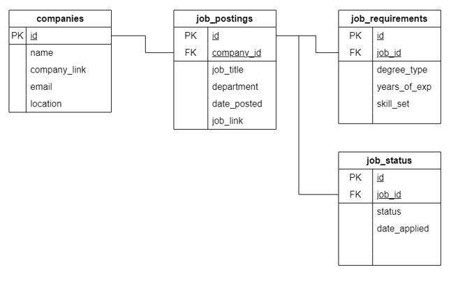

# Design Document

JobHunt

By Jonathan

GitHub username: jonxjonx

## Scope

The purpose of JobHunt database is to help users efficiently organize and manage their job search. As such, included in the database's scope is:

* Companies, which includes the name of the company, link of company's website, company contact email and the location
* Job postings, which includes the job title, department, date posted, and link of the job posting
* Requirements for the job posting, which includes the degree type (BA, MA, PhD), years of experience, and skill set required (Python, PyTorch, C, SQL, Tableau, AWS)
* Status of the job application, which includes the status (Applied, Not Applied, Interviewed, Offered, Rejected), and date applied

Out of scope are elements like questions asked in the interview, number of interview rounds, and details about job bonuses.

## Functional Requirements

This database will support:

* Finding information of companies he is interested in
* Finding job postings that he is interested in or have applied to
* Finding requirements for the job posting
* Checking the status of the job application

In this iteration, the system will not support detailed queries of the interview.

## Representation

### Entities

The database includes the following entities

#### Companies

The `companies` table includes:

* `id`, which specifies the auto-incremented unique ID for the company as an `INT`. This column has the `PRIMARY KEY` constraint applied.

* `name`, which specifies the company's name as a `VARCHAR` up to 50 characters. This column has the `NOT NULL` constraint applied as it is required.

* `company_link`, which specifies the link for the company's website as a `VARCHAR` up to 70 characters. This column has the `NOT NULL` constraint applied as it is required.

* `email`, which specifies the company's contact email as a `VARCHAR` up to 50 characters.

* `location`, which specifies the company's location as a `VARCHAR` up to 70 characters. This column has the `NOT NULL` constraint applied as it is required.

#### Job Postings

The `job_postings` table includes:

* `id`, which specifies the auto-incremented unique ID for the job posting as an `INT`. This column has the `PRIMARY KEY` constraint applied.

* `company_id`, which specifies the company's ID as an `INT`. This column has the `NOT NULL` constraint applied as it is required and the `FOREIGN KEY` constraint applied, referencing the `id` column in the `companies` table.

* `job_title`, which specifies the title of the job as a `VARCHAR` up to 40 characters. This column has the `NOT NULL` constraint applied as it is required.

* `department`, which specifies the department of the job as a `VARCHAR` up to 40 characters. This column has the `NOT NULL` constraint applied as it is required.

* `date_posted`, which specifies the date posted for the job posting as a `DATE`. This column has the `NOT NULL` constraint applied as it is required.

* `job_link`, which specifies the link for the job posting as a `VARCHAR` up to 70 characters. This column has the `NOT NULL` constraint applied as it is required.

#### Job Requirements

The `job_requirements` table includes:

* `id`, which specifies the auto-incremented unique ID for the job requirement as an `INT`. This column has the `PRIMARY KEY` constraint applied.

* `job_id`, which specifies the job posting ID as an `INT`. This column has the `NOT NULL` constraint applied as it is required and the `FOREIGN KEY` constraint applied, referencing the `id` column in the `job_postings` table.

* `degree_type`, which specifies the type of the degree as an `ENUM` that can only take the values `BA`, `MA`, `PhD`. This column has the `NOT NULL` constraint applied as it is required.

* `year_of_exp`, which specifies the years of experience as a `TINYINT` since the value would be lesser than the maximum value of 127. This column has the `NOT NULL` constraint applied as it is required.

* `skill_set`, which specifies the skill set required as a `SET` that can take any combination of the specified skills `Python`, `PyTorch`, `C`, `SQL`, `Tableau`, `AWS`. This column has the `NOT NULL` constraint applied as it is required.

#### Job Status

The `job_status` table includes:

* `id`, which specifies the auto-incremented unique ID for the job status as an `INT`. This column has the `PRIMARY KEY` constraint applied.

* `job_id`, which specifies the job posting ID as an `INT`. This column has the `NOT NULL` constraint applied as it is required and the `FOREIGN KEY` constraint applied, referencing the `id` column in the `job_postings` table.

* `status`, which specifies the status of the job application as an `ENUM` that can only take the values `Applied`, `Not Applied`, `Interviewed`, `Offered`, `Rejected`. This column has the `NOT NULL` constraint applied as it is required.

* `date_applied`, which specifies the date applied for the job posting as a `DATE`. This column has the `NOT NULL` constraint applied as it is required.

### Relationships

The entity relationship diagram below describes the relationships among the entities in the database.

* One company can have multiple job postings
* Each job posting only requires a corresponding job requirement as the job requirement consist of multiple skill sets
* Each job posting only requires a corresponding job status

## Optimizations

It is common for users to find details of job postings of a particular company. Hence, indexes are created on the `company_id` column to speed up the process.
Similarly, it is also common for users to find the skill set required and the status of the job application. Hence, indexes are created on the `job_id` column to speed up the process.

## Limitations

The skill set column can store a predefined list of skills. However, if new technologies are introduced, the table structure must be altered to accommodate them.
